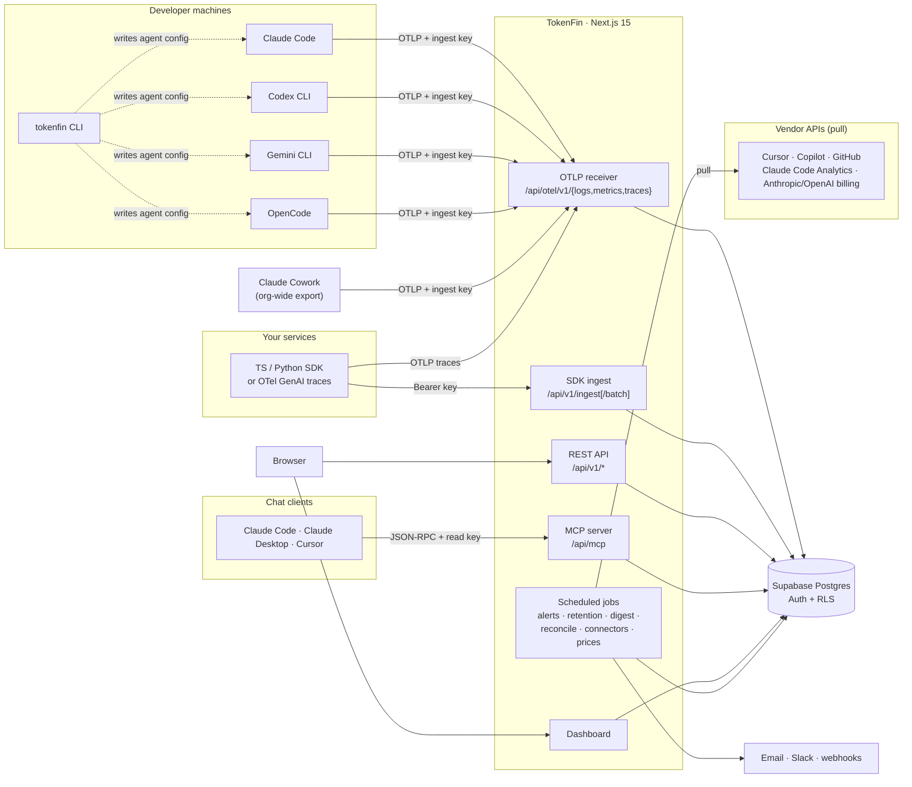
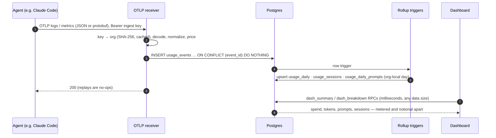
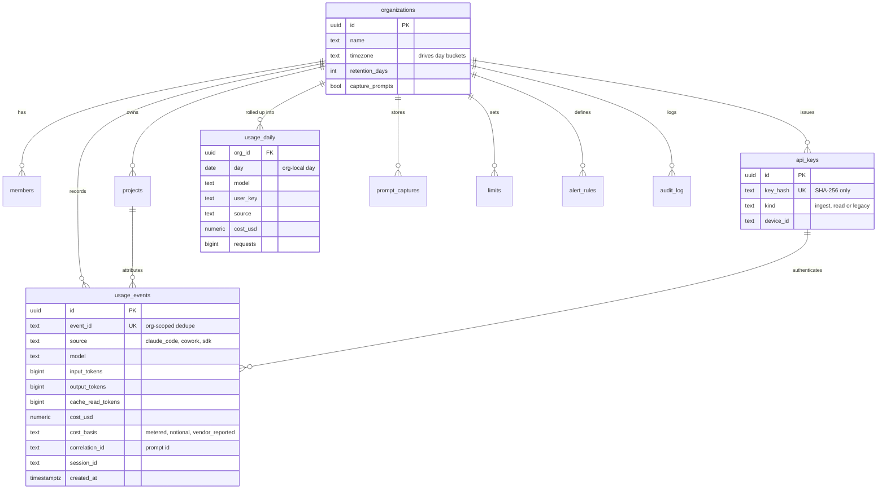

<div align="center">


### LLM cost attribution and FinOps for AI coding agents and your own AI apps

See what Claude Code, Claude Cowork, Codex, Gemini CLI, OpenCode and your own services spend on tokens — by project, model, team, person and prompt. TokenFin never sits in the model request path and never holds your provider API keys.

[](./LICENSE)
[](https://nextjs.org/)
[](https://www.typescriptlang.org/)
[](https://supabase.com/)
[](https://opentelemetry.io/)
[](./CONTRIBUTING.md)

**[Open TokenFin →](https://tokenfin.curiousdevs.com)** · Free and unlimited

</div>

---

## Contents

- [Why TokenFin](#why-tokenfin)
- [Features](#features)
- [Supported sources](#supported-sources)
- [How to use it](#how-to-use-it)
- [Architecture](#architecture)
- [Design notes](#design-notes)
- [Security and privacy](#security-and-privacy)
- [Tech stack](#tech-stack)
- [Documentation](#documentation)
- [Roadmap](#roadmap)
- [Contributing](#contributing)
- [License](#license)

---

## Why TokenFin

AI coding agents and LLM-backed services create spend that is hard to see and harder to attribute. The provider invoice tells you *how much*. It does not tell you *which project, which model, which engineer or which prompt* — or whether it was worth it.

TokenFin answers those questions with three principles:

- **Never in the request path.** Agents already emit OpenTelemetry; TokenFin is an OTLP receiver. There is no proxy to go down, no base-URL rewriting, and we never need your Anthropic, OpenAI or Google keys. ([Why this is a hard rule](./MIGRATION.md).)
- **Honest numbers.** Every event carries a `cost_basis`: `metered` is a real API bill, `notional` is subscription usage priced at API rates. The two are shown side by side and never added into one "bill".
- **Free and unlimited.** No plans, no billing, no usage caps. The limits in the product are budgets *you* set for your own team.

## Features

### See the spend

| | |
|---|---|
| **Overview** | Month-to-date and last-30-day spend (metered and notional separately), projected month-end from a real forecast, tokens, LLM calls, prompts and calls-per-prompt, with honest trend badges (hidden when there is no previous period). A **Live** pill only when data arrived in the last 15 minutes. |
| **Explore** | One flexible view: group spend by model, project, member, source, agent, skill, MCP server, repo, cost basis or day; filter by anything; drill down; share the URL; download CSV. |
| **Analytics** | Usage, by model, by project, cost reports, prompts, sessions, savings and bill check (metered usage vs. the provider's own bill). |
| **Prompts and sessions** | Every prompt joined to its tokens and cost, most-expensive prompts, and full session timelines. Members see only their own; owners and admins see the team. |
| **Traces** | A waterfall timeline for OpenTelemetry GenAI traces from your own apps (OTel GenAI, OpenLLMetry, OpenInference), with per-span tokens and cost. |
| **My usage & members** | A personal view for every engineer, and a drill-down page per team member. |
| **Engineering impact** | Cost per commit, per pull request, per 1k lines, and **cost per merged PR** from GitHub. |

### Act on it

| | |
|---|---|
| **Insights** | A waste finder with estimated monthly savings (expensive model on short outputs, missed prompt caching, retry storms, runaway sessions, idle keys, unused seats) and a **spike explainer** ("+$41 vs usual; 94% from alice on claude-opus in repo api"). |
| **What-if simulator** | Re-price last month with a different model mix, a higher cache-hit rate, capped outputs or seats moved to the API. |
| **Budgets and alerts** | Budgets with warn / throttle / block thresholds per org, project, team or member; alert rules (threshold, anomaly, budget) delivered by email, Slack, webhook or in-app; a weekly digest with top insights. |
| **Budgets as code** | Keep limits and alerts in a reviewed YAML file and apply them from CI: `npx tokenfin@latest budgets apply budgets.yaml`. |
| **Ask your spend** | Press **⌘K** and ask "top 3 models this month" or "how much did Priya spend last week" — answered from your data, with a link into Explore. |

### Run it for a team

| | |
|---|---|
| **One-command connect** | `npx tokenfin@latest setup` configures every installed agent on a machine and waits for the first real event. `login --device` covers SSH and devcontainers. |
| **Fleet rollout** | A Claude Code `managed-settings.json` for Jamf / Intune / Ansible, and a per-member rollout tracker. Claude Cowork is one org-wide admin setting. |
| **Teams and roles** | Owner / admin / member / viewer, teams, projects, email invites with a branded accept page, bulk provisioning with one-time key links, and SAML SSO. |
| **FinOps exports** | Monthly chargeback CSV by team, project or member; a **FOCUS 1.2** export; allocation rules for teams and cost centers. |
| **Pull connectors** | Claude Code Analytics, Cursor, GitHub Copilot and GitHub (merged PRs), plus Anthropic / OpenAI billing for the bill check. |
| **Governance** | An audit log of every sensitive change, per-org time zone, custom model prices, and a nightly check of our price table against the public catalog. |
| **Data controls** | Delete data older than 7 / 30 / 90 days or everything, automatic retention, and a workspace switch to stop storing prompt text. |

### Use it from anywhere

| | |
|---|---|
| **MCP server** | Ask your dashboard from Claude Code or Claude Desktop: breakdowns, sessions, prompts, month-to-date and forecast, budget status, insights. Read-only and role-aware. |
| **Claude Code plugin** | `/tokenfin:spend`, `/tokenfin:budget`, `/tokenfin:top-models`. |
| **Status line** | `TokenFin $1.23 today · $45.67 MTD · 62% of budget` in Claude Code, or `npx tokenfin@latest budget`. |
| **SDKs** | TypeScript and Python: wrap your Anthropic or OpenAI client in one line; events are batched, retried and never block your app. |

## Supported sources

| Source | How it's captured | Cost basis |
|---|---|---|
| **Claude Code** (CLI, VS Code, JetBrains) | Native OpenTelemetry logs — one row per API call, prompt text optional | notional |
| **Claude Cowork** | Org-wide OpenTelemetry export (Admin settings → Cowork) | notional |
| **Codex CLI** | Native OpenTelemetry metrics | notional |
| **Gemini CLI** | Native OpenTelemetry metrics | notional |
| **OpenCode** | TokenFin plugin (`plugins/opencode`) — one row per assistant message, cache + reasoning tokens, prompt text optional | notional (subscription) / metered (API key) |
| **Your apps** | TypeScript / Python SDK, `POST /api/v1/ingest`, or OTel GenAI traces | metered |
| **Cursor, GitHub Copilot, Claude Code Analytics** | Pull connectors (daily sync) | vendor-reported |
| **Anthropic / OpenAI billing** | Admin API (daily sync) for the bill check | vendor-reported |

## How to use it

### 1. Create your workspace

Sign up at [tokenfin.curiousdevs.com](https://tokenfin.curiousdevs.com). Your workspace is created instantly; create a first project and you're on the dashboard.

### 2. Connect your coding agents

On each developer machine:

```bash
npx tokenfin@latest setup
```

It opens your browser to sign in, gives this machine its own keys, configures every installed agent (Claude Code, Codex CLI, Gemini CLI, OpenCode) and finishes when the first real event arrives. Useful follow-ups:

```bash
npx tokenfin@latest status      # is everything connected and sending?
npx tokenfin@latest doctor      # why aren't events arriving?
npx tokenfin@latest budget      # today / month-to-date spend and your tightest budget
npx tokenfin@latest setup --statusline   # budget line in Claude Code
npx tokenfin@latest setup --no-prompts   # never send prompt text from this machine
```

**Claude Cowork** (Team / Enterprise): in Claude → **Admin settings → Cowork**, set the OTLP endpoint, protocol and header shown on TokenFin's **Connections** page, then start a new Cowork session.

**A whole team at once:** Connections → *Roll out to your team* → download `managed-settings.json` and push it with your device-management tool. See [ROLLOUT.md](./docs/ROLLOUT.md).

### 3. Track your own AI app

```ts
import Anthropic from '@anthropic-ai/sdk'
import { TokenFinClient, wrapAnthropic } from 'tokenfin-sdk'

const tf = new TokenFinClient({ apiKey: process.env.TOKENFIN_API_KEY! })
const anthropic = wrapAnthropic(new Anthropic(), tf, { tags: { feature: 'chat' } })
// every call is now tracked — tokens, cache tokens, latency, cost
```

```python
from anthropic import Anthropic
from tokenfin import TokenFinClient, wrap_anthropic

tf = TokenFinClient(api_key="tfk_...")
client = wrap_anthropic(Anthropic(), tf, tags={"feature": "chat"})
```

Or send OpenTelemetry GenAI traces to `/api/otel/v1/traces` ([TRACES.md](./docs/TRACES.md)), or post events directly:

```bash
curl -X POST https://tokenfin.curiousdevs.com/api/v1/ingest \
  -H "Authorization: Bearer $TOKENFIN_API_KEY" -H "Content-Type: application/json" \
  -d '{"model":"claude-sonnet-4-6","input_tokens":812,"output_tokens":164,"tags":{"feature":"chat"}}'
```

### 4. Invite your team

**Teams → Invite** (or **Provision** for many people at once). Invitees get an email, accept, and land in your workspace. People who already use TokenFin see the invitation on their dashboard.

### 5. Set budgets and alerts

**Govern → Limits** for budgets, **Govern → Alerts** for rules and channels (email, Slack, webhook, in-app). Link an alert to a budget so it fires before the money is gone. Prefer code? Use [budgets as code](./cli/README.md#budgets-as-code).

### 6. Find savings

Open **Insights** for ranked savings opportunities and spike explanations, and **What-if** to price a change before you make it. Every finding links to the evidence in **Explore**.

### 7. Ask from chat

Add the TokenFin MCP server to Claude Code (setup does it for you) or install the plugin from [`plugins/claude-code`](./plugins/claude-code), then ask *"what did we spend on Opus this week?"*. Snippets for Claude Desktop and Cursor are on the **Platforms** page. See [MCP.md](./docs/MCP.md).

### 8. Report and govern

- **Cost reports → Export**: daily CSV and monthly chargeback by team / project / member.
- **Settings → Allocation**: split shared spend across teams and cost centers; the FOCUS export applies it.
- **Settings → Workspace**: name, time zone, prompt-text capture, SSO.
- **Settings → Data**: retention and deletion. **Settings → Audit log**: who changed what.

## Architecture

### System context



AI providers never appear on the request path: agents talk to Anthropic, OpenAI and Google directly, and TokenFin only receives the telemetry they emit.

### How an event flows



- **Logs** (Claude Code, Cowork): one row per API call, with the prompt joined by `prompt.id`.
- **OpenCode plugin**: one row per completed assistant message via `/api/v1/ingest/batch`, with the prompt joined by the user message id.
- **Metrics** (Codex, Gemini): per-turn rows derived from counters and histograms, with cumulative series diffed so nothing is counted twice.
- **Traces** (your apps): only leaf LLM spans are mirrored into usage, so parent spans never double-count.

### Data model



`usage_events` is the source of truth. Triggers keep `usage_daily`, `usage_sessions` and `usage_daily_prompts` current, and everything the dashboard shows is read from the rollups through a handful of SQL functions, so pages stay fast at any volume. Migrations live in [`db/migrations/`](./db/migrations) (ordered, idempotent, applied twice in CI).

## Design notes

- **Receiver, not proxy.** The product's reliability can never become your agents' reliability problem. Capture is push-only (OTLP, SDK) or pull-only (vendor APIs).
- **One mapping file per signal.** Agent telemetry names change; the mappings are versioned in one place (`lib/otlp/mapping.ts`, `lib/otlp/genai.ts`) and unknown metrics are logged loudly, never silently dropped.
- **Idempotent everywhere.** Every event has a deterministic `event_id`; replays, retries and split exports never create duplicates. Cumulative counters are diffed with an atomic state table.
- **Rollups by trigger, not by batch job.** Daily, session and prompt rollups are maintained in the same transaction as the event, in the org's time zone, and rebuild automatically when the time zone changes.
- **Metered vs. notional is a type, not a label.** A subscription's value priced at API rates is useful; adding it to a real bill is wrong. Every total keeps them apart.
- **No mock data, ever.** Empty states explain how to connect a source; trends come from a real previous period or are hidden.
- **Least privilege by default.** Per-device keys split into ingest-only and read-only; members see their own prompts and sessions; service-role access stays on the server.
- **Server components fetch, client components interact.** Every page is a server `page.tsx` plus a `_client.tsx`, with one shared org lookup (`requireOrgContext`) so every page agrees on which workspace you are in.

## Security and privacy

- **No provider keys, no proxy.** TokenFin cannot see or reuse your Anthropic, OpenAI or Google credentials.
- **Keys are hashed.** API keys are stored only as SHA-256 hashes plus a masked prefix; the raw key is shown once. One-time reveal links are AES-256-GCM encrypted and single-use.
- **Row-Level Security** on every table; prompt text, sessions and spans are readable only by their owner or an org admin. Sensitive tables are service-role only.
- **Role-aware MCP.** A member's key sees only that member's prompts and sessions.
- **Your data, your retention.** Delete by age or everything, set automatic retention, or stop storing prompt text for the whole workspace. Prompt text is redacted for secrets before it is stored.
- **Security headers and fail-closed jobs.** CSP, frame and MIME protections on every page; scheduled jobs refuse to run without their secret.

Found a vulnerability? Please follow [SECURITY.md](./SECURITY.md) instead of opening a public issue.

## Tech stack

| Layer | Technology |
|---|---|
| Web app and API | Next.js 15 (App Router), React, TypeScript (strict), Tailwind CSS, Recharts |
| Database and auth | Supabase — Postgres with Row-Level Security, Supabase Auth (email, GitHub, Google, SAML SSO) |
| Telemetry intake | OTLP/HTTP, JSON and protobuf |
| MCP | Streamable HTTP, JSON-RPC 2.0 |
| CLI | Node.js, zero runtime dependencies (`npx tokenfin`) |
| SDKs | TypeScript (`tokenfin-sdk`), Python (`tokenfin`) |
| Email / chat delivery | Resend, Slack, webhooks |
| Hosting | Vercel + Supabase, with GitHub Actions for CI and scheduled jobs |

## Documentation

| Doc | Covers |
|---|---|
| [SETUP.md](./SETUP.md) | Running TokenFin locally and self-hosting |
| [docs/ROLLOUT.md](./docs/ROLLOUT.md) | Rolling out to a team: managed settings, tracker, privacy, offboarding |
| [docs/SETUP_HUB.md](./docs/SETUP_HUB.md) | Per-agent connection details, keys, prompt capture, status line |
| [docs/MCP.md](./docs/MCP.md) | MCP server, tools and client configs |
| [docs/TRACES.md](./docs/TRACES.md) | Sending OpenTelemetry GenAI traces from your apps |
| [docs/data-flow.md](./docs/data-flow.md) | Capture paths, metered vs. notional, metric derivation |
| [docs/alerts-and-limits.md](./docs/alerts-and-limits.md) | What limits enforce vs. warn about, how alerts fire |
| [docs/architecture.md](./docs/architecture.md) | System map and auth flow |
| [docs/OPERATIONS.md](./docs/OPERATIONS.md) | Health checks, scheduled jobs, logs, scaling |
| [cli/README.md](./cli/README.md) | CLI command reference |
| [MIGRATION.md](./MIGRATION.md) | Why there is no proxy |

## Roadmap

- [x] Claude Code, Codex CLI and Claude Cowork capture
- [x] Rollup tables: dashboards in milliseconds at any volume
- [x] Explore, Insights, What-if, Traces, ⌘K ask-your-spend
- [x] Pull connectors, FOCUS export, allocation, budgets as code
- [x] Per-device keys, role-aware MCP, prompt privacy, audit log, SSO
- [ ] Gemini CLI and OpenCode: verification against real sessions
- [ ] OAuth on the MCP server, so it works as a Cowork / claude.ai connector
- [ ] More providers in the price table and more pull connectors

## Contributing

Contributions are welcome — bug reports, new agent mappings, connectors, docs. Read [CONTRIBUTING.md](./CONTRIBUTING.md) for local setup, conventions (server/client split, admin-client rule, no mock data, idempotent migrations) and the pull-request checklist. Please open an issue first for larger changes.

## License

TokenFin is released under the [MIT License](./LICENSE).
