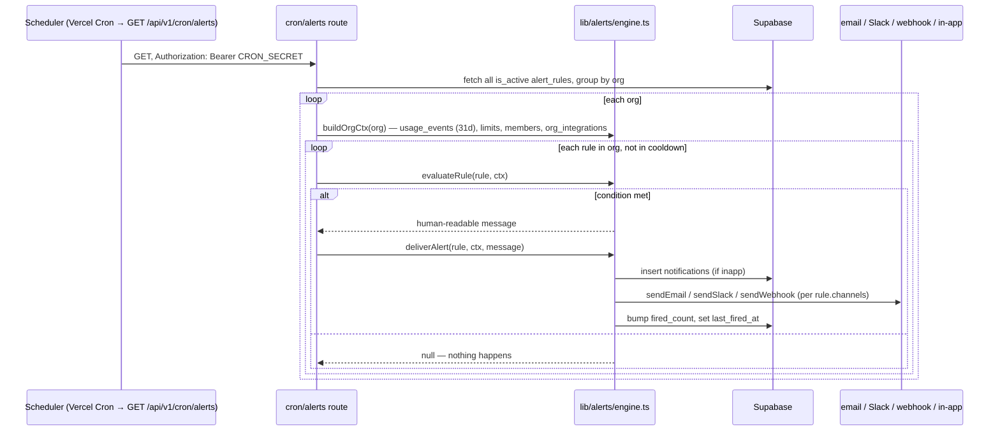

# Alerts and Limits

Two related but separate systems. **Limits** are a stored budget + thresholds.
**Alerts** are user-configured rules that get evaluated on a schedule and
delivered somewhere. A limit can optionally have an alert rule attached to it
(the "Create alert rule" checkbox when you create a limit, or "Add alert rule"
from a limit's menu) — but they're independent tables with no foreign key
between them (see below).

---

## Limits: tracking vs. enforcement (these are not the same thing)

A `limits` row has `scope` (org/project/team/member), `period`
(daily/weekly/monthly), `budget_usd`, and three percentages: `warn_at`,
`throttle_at`, `block_at`. What actually happens at each threshold depends
entirely on **where the spend came from** — this table is the one thing to
memorize before touching this feature:

| Threshold | CLI agents (Claude Code/Codex/Gemini) | SDK / `POST /api/v1/ingest` |
|---|---|---|
| Warn % | ✅ Dashboard shows it, alert rules can fire | ✅ same |
| Throttle % | ❌ **cannot** — TokenFin isn't in the request path | ✅ real `429`, org-scoped monthly limits only |
| Block % | ❌ **cannot** — same reason | ✅ real `403`, org-scoped monthly limits only |

This isn't a gap to eventually close — it's the direct consequence of the
architecture decision in `MIGRATION.md` (no proxy in the CLI agent's request
path, ever). The Limits page banner states this plainly now; it used to imply
throttle/block applied universally, which was actively misleading for the
majority of users who only ever connect via `tokenfin setup`.

**Spend display** (the number on each limit card) reads `usage_events`
directly — *all* captured spend, metered and notional together, for warning
purposes. This was a real bug until 2026-08-10: it originally read
`usage_agg`, which is metered-only, so a limit on a CLI-agent-only project
showed 0% forever. See [`data-flow.md`](./data-flow.md#the-metered-vs-notional-split).

**Real enforcement** (the `403`/`429` in `/api/v1/ingest`) reads `usage_agg`
— correctly, in this one specific case, because enforcement is *only* possible
for the metered SDK path anyway, and `usage_agg` is exactly the metered
subset. Don't "fix" this one to read `usage_events` — that would let notional
CLI-agent spend it can't even see block real API traffic it can.

---

## Alerts: how a rule actually fires

Verified for real (2026-08-10): created a `threshold` rule with a $1 limit
against ~$8 of real captured spend, hit the actual cron endpoint, got
`{"evaluated":3,"fired":1}`, and the notification showed up in Alerts →
History with the correct timestamp.

**Same metered/notional bug existed here too**, and for the identical reason:
`buildOrgCtx()` originally built its spend context from `usage_agg`, so
`threshold`/`anomaly`/`limit_breach` rules could never fire for CLI-agent-only
usage — the majority case. Fixed the same way as Limits: reads
`usage_events` now. `member`-type rules never had this bug (already read
`usage_events`).

### Trigger types

- **`threshold`** — window spend (daily/weekly/monthly, inferred from the
  condition text) crosses `rule.threshold`.
- **`anomaly`** — today's spend is >3× the trailing-7-day daily average (and
  >$1, to avoid noise on near-zero accounts).
- **`limit_breach`** — mirrors an org/project `limits` row's `warn_at`; fires
  the *worst* (highest %) breach across all matching limits.
- **`member`** — a single user's month-to-date spend crosses `rule.threshold`.

### Cooldown and delivery

`cooldown_hours` (default 4) blocks re-firing the same rule too often —
checked against `last_fired_at` before evaluation even runs. Delivery is
fail-open per channel: an email/Slack/webhook failure doesn't stop the
`inapp` notification from landing, and vice versa. Slack/webhook URLs come
from `org_integrations` (see below) — a rule with `channels.slack = true` but
no Slack integration connected just silently has nothing to send to.

### The `limits` ↔ `alert_rules` link is inferred, not a foreign key

There's no `limit_id` column on `alert_rules`. "This limit has an alert"
is worked out by matching `(org_id, trigger_type='limit_breach', scope ===
limit's scope name)` — a string match, not a real relationship. This was
silently broken until 2026-08-10 too: the Limits page hardcoded every card to
show "No alert" regardless of whether one actually existed, because nothing
ever checked. If you're building on this link, don't assume it's authoritative
for anything more than a UI hint — two limits with the same scope name (e.g.
two projects both literally named "API") would be indistinguishable to it.

---

## Integrations feed alert delivery

Slack/webhook URLs for alert delivery live in `org_integrations`
(`provider`, `config`, `is_active`) — connected from the Integrations page.
**The column is `provider`, not `integration`** — the entire connect flow
(GET/POST/DELETE on `/api/v1/integrations`, plus the page's own initial
server-side load) was writing/reading a column called `integration` that
doesn't exist in the schema until 2026-08-10, so every "Connect" attempt
500'd, and — because the initial-load query swallowed its own error —
the page just always silently showed "0 connected" instead of surfacing
anything was wrong. If you touch this route again, `provider` is the real
column; keep `integration` as the external JSON field name for the API
contract (that part was fine), just map it internally.
