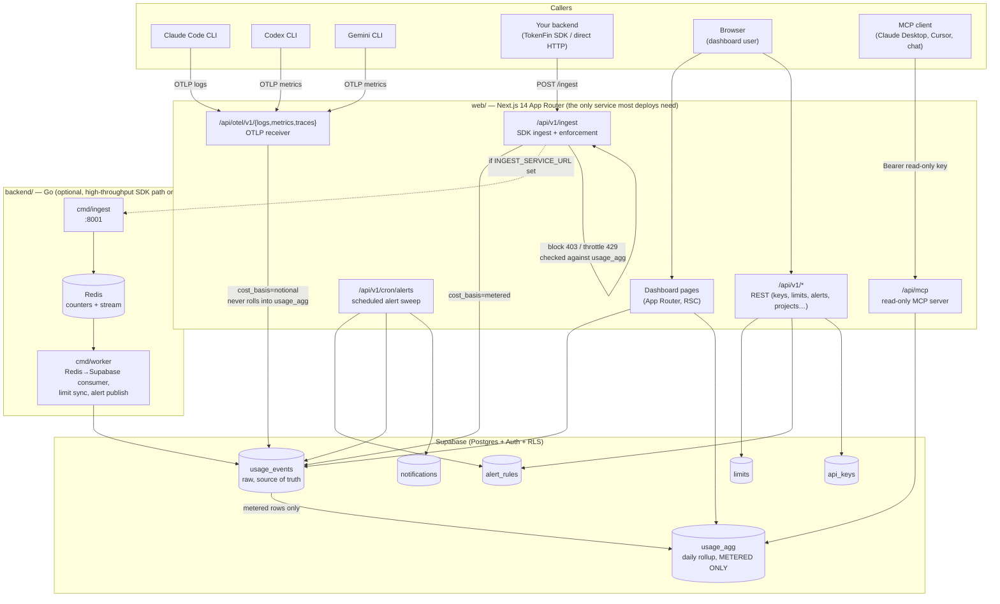

# TokenFin Architecture

> Supersedes the previous version of this file, which described a
> pre-monorepo layout and an unbuilt "planned" Go backend that now exists and
> is live. If you find this file drifting from the code again, fix the file —
> don't work around it.

TokenFin is an LLM cost-attribution / FinOps platform. It tracks token usage
and spend across projects, models, and team members, for two very different
kinds of callers:

1. **CLI coding agents** (Claude Code, Codex CLI, Gemini CLI) that push their
   own OpenTelemetry telemetry to us. We never sit in their request path.
2. **Your own backend code**, instrumented with the TokenFin SDK or calling
   `POST /api/v1/ingest` directly. We sit in front of this write, so this is
   the only path where real spend *enforcement* (block/throttle) is possible.

Conflating these two is the single most common way to misread this codebase —
see [`data-flow.md`](./data-flow.md) for why they're deliberately kept apart
all the way down to which DB columns they're allowed to touch.

---

## System map



**The one thing to internalize**: `usage_events` holds everything; `usage_agg`
holds a strict subset (metered rows only). Anything that must never show a
number bigger than the real bill (Analytics totals, SDK-side limit
enforcement) reads `usage_agg`. Anything that should see *all* captured
activity, including CLI-agent notional usage, reads `usage_events` directly
(Limits page spend, the alert engine, My Usage, team-scoped limits). Getting
this backwards is a real bug class — see the note in [`data-flow.md`](./data-flow.md#the-metered-vs-notional-split).

---

## Monorepo layout

```
tokenfin/
├── web/                          Next.js 14 App Router — UI + all API routes
│   ├── src/app/
│   │   ├── (auth)/               login, signup, forgot/reset-password, accept-invitation
│   │   ├── (onboarding)/         org + first-project wizard
│   │   ├── (dashboard)/dashboard/
│   │   │   ├── page.tsx                    Overview (server component)
│   │   │   ├── projects/ teams/ keys/       management pages
│   │   │   ├── limits/ alerts/              spend guardrails + notifications
│   │   │   ├── setup/                       "Connections" — the CLI onboarding surface
│   │   │   ├── mcp/                         "Platforms" — connected-key accuracy view
│   │   │   ├── integrations/                Slack/Datadog/etc. connectors
│   │   │   └── analytics/{models,projects,costs,prompts,savings}/
│   │   ├── api/v1/                REST routes (keys, limits, alerts, projects, orgs, ingest…)
│   │   ├── api/otel/v1/{logs,metrics,traces}   OTLP receiver
│   │   ├── api/mcp/               MCP server (JSON-RPC over Streamable HTTP)
│   │   └── cli/authorize/         browser half of `tokenfin login`
│   ├── src/lib/
│   │   ├── otlp/                  auth · decode · mapping · normalize · metrics · persist
│   │   ├── alerts/engine.ts       rule evaluation + delivery (used by cron and "test fire")
│   │   ├── mcp/                   MCP tool implementations (run.ts), pricing, compress/CCR
│   │   └── supabase/server.ts     createClient() (RLS) vs createAdminClient() (service-role)
│   └── src/components/            dashboard/, layout/, onboarding/, ui/
│
├── backend/                       Go — SDK ingest scaling path, OFF by default
│   ├── cmd/ingest/                high-throughput POST /v1/ingest (Redis-buffered)
│   ├── cmd/worker/                consumer + limits sync + alert-stream publisher
│   └── internal/{auth,config,db,redis,models,pricing}/
│
├── cli/                           npm package `tokenfin` — the customer-facing setup tool
│   ├── bin/tokenfin.js
│   └── lib/{login,setup,status,doctor,remove,otel,api,config}.js
│
├── sdk/                           Client SDKs customers embed in their own backend
├── db/                            schema.sql, migrations/, functions.sql
├── docs/                          you are here
├── CLAUDE.md                      AI-session reference (schema table, page→data-source map)
└── MIGRATION.md                   what was deliberately removed and why — read before
                                    reintroducing a proxy, hook, or write-capable MCP tool
```

---

## Tech stack

| Layer | Choice |
|---|---|
| Frontend/API | Next.js 14 App Router, TypeScript strict, `src/` dir |
| Database | Supabase (Postgres + Auth + RLS) |
| Styling | Tailwind CSS + CSS custom properties |
| Charts | Recharts |
| High-throughput ingest (optional) | Go + Redis |
| CLI | Plain Node (CommonJS), zero dependencies beyond what ships in `cli/lib` |
| Email | Resend (alerts only; blank key = alerts silently skip email, everything else still works) |

## Supabase client rule

```ts
createClient()       // anon/user, respects RLS — Server Components, session-bound API routes
createAdminClient()  // service-role, bypasses RLS — cron, OTLP receiver, admin-gated API routes
```
`createAdminClient()` is server-only and forces `cache: 'no-store'` on every
fetch — a service-role client that silently served a stale privileged read
would be a real bug (e.g. alert cooldown re-firing off cached `last_fired_at`).

## Auth flow (dashboard)

1. Supabase Auth (email/password, GitHub, Google) → session cookie.
2. `middleware.ts` reads the cookie on every request, redirects unauthenticated
   hits on `/dashboard/*` to `/login`.
3. `(dashboard)/layout.tsx` (a Server Component) checks the `members` table for
   the signed-in user; no membership → `/plans`; membership but no project →
   `/onboarding`.
4. API routes call `requireOrgMember` / `requirePermission` / `requireApiKeyOrOrgMember`
   (`lib/api/auth.ts`) depending on whether they accept a session, an API key,
   or either.

**A real bug we hit and fixed here**: right after onboarding creates the
org/membership/project, the client used `router.push()` into a route whose
server layout gates on that same data. Next.js's client Router Cache had
already cached an *earlier* render of that route (from before the mutation),
so the stale cached response — which was itself a redirect back to `/plans` —
got served instead of a fresh one. Every `router.push()` that follows a
mutation of the exact data the destination route gates on now calls
`router.refresh()` first. If you add a new onboarding-adjacent redirect, apply
the same pattern.

## Design tokens

CSS custom properties in `globals.css`: `--fg`, `--bg`, `--border`, `--green`,
`--red`, `--blue`, `--amber` (each with a `-secondary`/`-bg` variant). Utility
classes: `btn-primary`, `btn-secondary`. New UI should reuse `components/ui/*`
primitives rather than hand-rolling another card/badge/button style.
