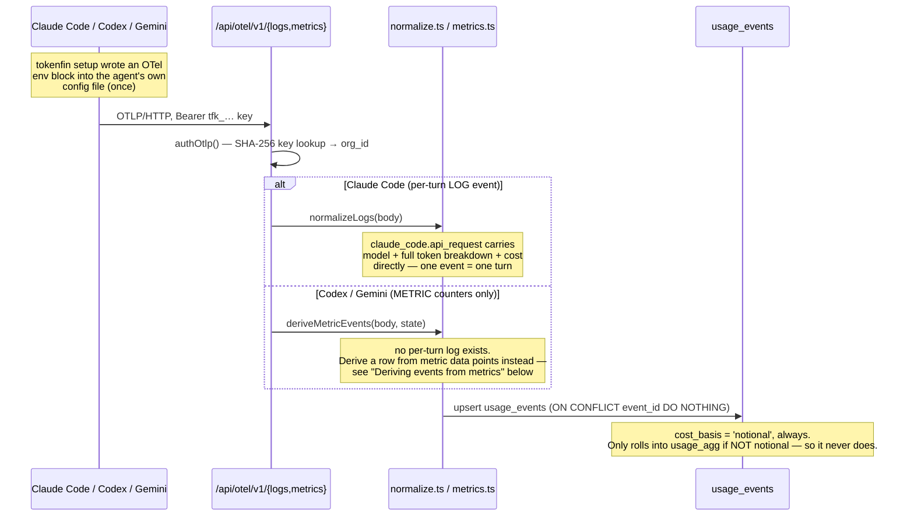
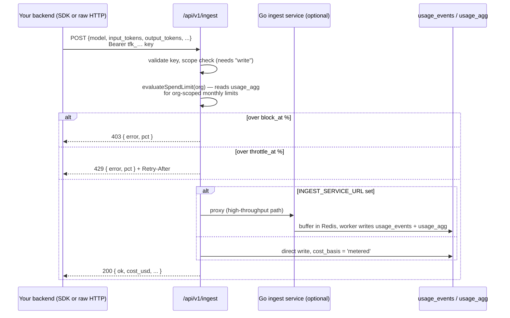

# Data flow: capture, storage, cost

This is the doc to read before touching anything in `web/src/lib/otlp/`,
`web/src/app/api/v1/ingest/`, or `usage_agg`. Everything here was verified
against real, running agents (`claude`, `codex exec`) during a live debugging
session, not just read from the code — where the two disagreed, the code was
wrong and got fixed. Specifics are dated so future readers know how fresh
each claim is.

## The metered vs notional split

This is the load-bearing invariant of the whole schema. Two `cost_basis` values
matter day to day:

- **`metered`** — a real bill. Only `POST /api/v1/ingest` (the SDK path)
  produces this.
- **`notional`** — "what this would have cost at API rates." Every CLI-agent
  OTLP event (Claude Code, Codex, Gemini) is notional, always — Claude Code
  Pro/Max subscribers aren't billed per-token, so there's no real bill to
  report; we're pricing their usage at API rates as an estimate.

**Rule: notional dollars must never be summed into a total that claims to be a
real bill.** `usage_agg` (the pre-aggregated table almost every Analytics
chart reads) enforces this at the write site — `persistRows()`
(`lib/otlp/persist.ts`) only rolls a row into `usage_agg` when
`cost_basis !== 'notional'`. `usage_events` has no such filter; it holds
everything.

The consequence, if you forget this: **`usage_agg` is structurally blind to
all CLI-agent usage.** We hit this for real — Limits' spend tracking and the
entire alert-evaluation engine both originally read `usage_agg`, so a budget
limit or a "spend > $X" alert on a project used only via `tokenfin setup`
sat at 0% forever, no matter how much was actually spent. Team-scoped limits
never had this bug, because they'd always read `usage_events` directly. Fixed
by making org/project-scoped limits and the alert engine do the same
(2026-08-10) — see `web/src/app/(dashboard)/dashboard/limits/page.tsx` and
`web/src/lib/alerts/engine.ts`.

**When you add a new feature that computes "spend," ask first: does this need
to be a real bill (use `usage_agg`), or does it need to see everything the
user is actually doing (use `usage_events`)?** Analytics totals and SDK-side
enforcement are the former. Limits display, alerts, and My Usage are the
latter.

---

## Path 1 — CLI agents (OTLP push)

TokenFin never sits between the agent and the model provider. This is
deliberate, not a missing feature — see `MIGRATION.md` for the incident that
led to ripping out the old proxy/hook/`record_usage` approach. The practical
result: **we can warn about CLI-agent spend, we cannot block or throttle it.**
The Limits page says this outright now (it used to imply otherwise).

### Claude Code — the fully-verified path

Real per-turn data, no derivation needed. Each `claude_code.api_request` log
event already carries model, input/output/cache tokens, and cost.
`normalizeLogs()` (`lib/otlp/normalize.ts`) turns it into one row directly.
Verified end-to-end with a real `claude -p` call (2026-08-10): event landed,
dashboard reflected it within seconds.

### Deriving events from metrics (Codex, Gemini)

Codex and Gemini don't emit a per-turn log — token usage only shows up as
OTLP **metrics**. `deriveMetricEvents()` (`lib/otlp/metrics.ts`) has to turn a
stream of metric data points into discrete per-turn rows, and the two metric
*shapes* you'll see are genuinely different:

- **Counter-style (`sum`/`gauge`)**: a monotonically growing total. First
  time we see a series, store the value as a baseline and emit nothing (we
  can't know how much of the total is "new" yet). Every export after that,
  emit `current − last-seen`. A counter reset emits nothing rather than a
  negative number. State is in the `otlp_metric_state` table, keyed by
  `(org, metric name, model, correlation, token type)`.
- **Histogram (`histogram`)** — **this is what Codex actually sends**,
  confirmed on a real `codex exec` session (2026-08-10). There is no
  cumulative-counter concept for a histogram: each data point already *is*
  one fresh observation (Codex emits one histogram data point per
  `token_type` per turn). Treat every histogram data point as delta,
  regardless of what `aggregationTemporality` it claims — there's nothing to
  diff against.

The code originally only read `m.sum.dataPoints` / `m.gauge.dataPoints`, so
for Codex specifically the loop found zero data points, ever — Codex
integration derived nothing regardless of how correct the rest of the config
was. Fixed 2026-08-10.

**Attribute name, not `type`**: Codex's real token-type attribute key is
`token_type` (values observed: `input`, `output`, `cached_input`,
`cache_write_input`, `reasoning_output`, `total`). The mapping originally only
checked `type` / `gen_ai.token.type`. Also fixed.

**Cache/reasoning tokens are a breakdown of input/output, not additive** —
proved with real numbers from one Codex turn: `input (13699) + output (5) =
total (13704)` exactly. `cached_input` (11008) is a *subset* of `input`, the
same convention OpenAI uses everywhere else (`prompt_tokens_details`,
`completion_tokens_details`). The derivation originally added
`cache_read_tokens` on top of `input_tokens` when pricing a row — that
double-charges the cached portion. Cost is now computed from
`input_tokens + output_tokens` only; cache/reasoning are still stored in
their own columns for an accurate breakdown *display*, just not priced twice.

**Unrecognized metric names are logged loudly, never dropped silently**
(`isRecognizedMetric()` / `KNOWN_NON_TOKEN_METRICS` in `lib/otlp/mapping.ts`).
Vendors rename attributes without warning — that's the whole reason this
mapping lives in one file instead of being inlined at each call site. When you
see `[otlp] unrecognized metric "..."` in logs from a real session, that's
the system working as designed: go add the name to `KNOWN_NON_TOKEN_METRICS`
(if it's legitimate but not usage-bearing) or to the derivation logic (if it
carries tokens) — **only after confirming it on a real session**, not by
guessing at what a vendor's docs say. Speculative entries here have been
wrong before (see the Codex findings above).

---

## Path 2 — SDK / direct ingest (`POST /api/v1/ingest`)

This is the **only** path where TokenFin can genuinely stop a request —
because the caller is expected to wait for the response, a `403`/`429` here
is a real signal the caller's own code can act on. Verified for real
(2026-08-10): sent a request over budget, got `403 {"error":"Monthly spend
limit reached — ingestion is blocked","pct":200}`.

Enforcement is **org-scoped, monthly only** — `evaluateSpendLimit()`
(`api/v1/ingest/route.ts`) doesn't look at project- or team-scoped limits at
all. A project-scoped limit will show correct spend (via the Limits page,
which reads `usage_events`) but won't block anything at the ingest layer.

The Go backend (`backend/`) is an optional scaling layer for this path only —
Redis-buffered counters so `evaluateSpendLimit`-equivalent checks are O(1)
instead of a DB round-trip per request, plus a worker that reconciles counter
drift every 5 minutes. It's entirely inert unless `INGEST_SERVICE_URL` is set;
the Next.js route works standalone otherwise. It has nothing to do with
CLI-agent capture — don't reach for it when debugging OTLP issues.

---

## Where things end up

| Table | What's in it | Who writes it | Who reads it |
|---|---|---|---|
| `usage_events` | Every captured event, any `cost_basis` | OTLP receiver, `/api/v1/ingest`, Go worker, MCP `compress` tool | Limits, alerts, My Usage, Analytics (some views), Platforms accuracy badges |
| `usage_agg` | Daily rollup, **metered only** | `persistRows()` (from `usage_events`, filtered), Go worker | Most Analytics charts, `/api/v1/ingest`'s own limit check, MCP `get_spend`/`get_usage_by_model`/`get_daily_costs` |
| `otlp_metric_state` | Last-seen cumulative value per metric series | `deriveMetricEvents()` | itself (state only) |
| `limits` | Configured budgets/thresholds | Dashboard UI | Limits page, alert engine, `/api/v1/ingest` enforcement |
| `alert_rules` / `notifications` | User rules / fired history | Dashboard UI / alert engine | Alerts page, topbar bell |

See [`alerts-and-limits.md`](./alerts-and-limits.md) for how those last two
tables actually get evaluated and delivered.
